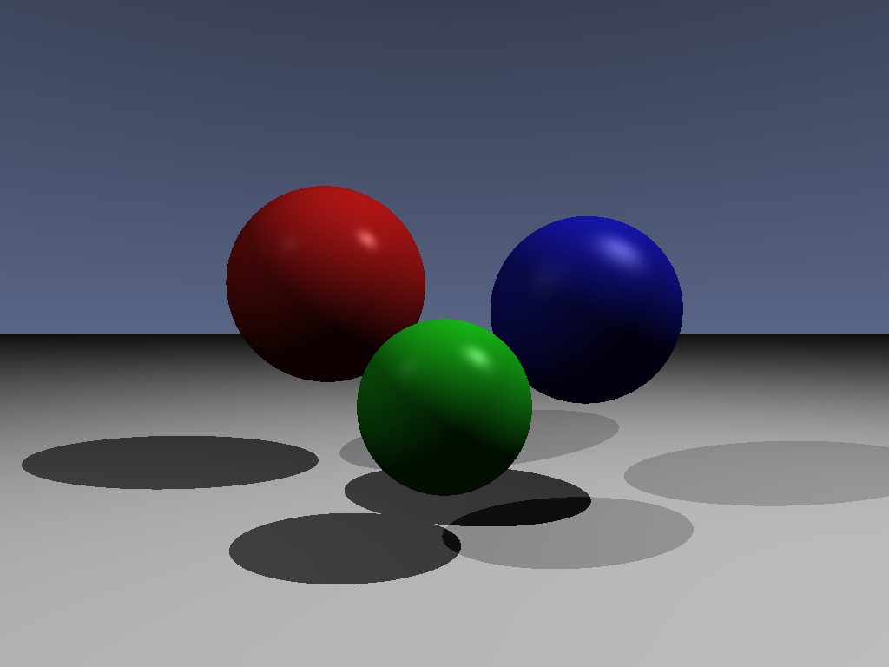
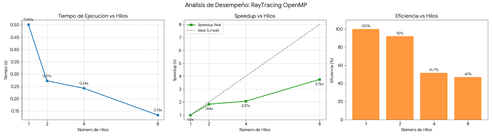

# Reporte de Desempeño: RayTracing con OpenMP

# Integrantes del proyecto
## 👥 Integrantes del Equipo

| Código | Apellidos | Nombres | Correo institucional |
|--------|-----------|----------|------------------------|
| **22200174** | Ordoñez Neyra | Andrés Rafael | andres.ordonez@unmsm.edu.pe |
| **22200163** | Dominguez Coyuri | Bruce Stivens | bruce.dominguez@unmsm.edu.pe |
| **22200160** | Bazalar Cruz | Carlos Alonso | carlos.bazalar1@unmsm.edu.pe |
| **22200052** | Uribe Mejía | Guillermo César | guillermo.uribe@unmsm.edu.pe |


## 1. Descripción del Proyecto
Este proyecto implementa un algoritmo de **Ray Tracing** simple paralelizado utilizando **OpenMP** en C++. El objetivo es renderizar una escena 3D calculando el color de cada píxel basándose en la intersección de rayos con objetos (esferas) en la escena. La paralelización busca reducir el tiempo de renderizado distribuyendo la carga de trabajo de los píxeles entre múltiples hilos de la CPU.

## 2. Estrategia de Paralelización
La estrategia principal consiste en descomponer el bucle principal de renderizado. Dado que el cálculo de cada rayo/píxel es independiente de los demás (paralelismo de datos), se aplicó la directiva `#pragma omp parallel for` al bucle externo que recorre las filas de la imagen.

* **Región Paralela:** Bucle anidado que recorre el alto (`height`) y ancho (`width`) de la imagen.
* **Directivas OpenMP:** Se utilizó `parallel for` para distribuir las iteraciones.
* **Datos:** Se aseguró que no existieran condiciones de carrera en la escritura del buffer de imagen `img`.



## 3. Entorno de Pruebas
* **Sistema Operativo:** Windows
* **Compilador/Entorno:** MSVC / Visual Studio (Ejecutado desde PowerShell)
* **Procesador:** Intel Core i5 1135G7
* **Núcleos Físicos/Lógicos:** 4 núcleos

## 4. Resultados de Ejecución

A continuación se presentan los tiempos de ejecución obtenidos al variar el número de hilos (`OMP_NUM_THREADS`).

| Hilos ($p$) | Tiempo ($T_p$) [s] | Speedup ($S_p = T_1 / T_p$) | Eficiencia ($E_p = S_p / p$) |
| :---: | :---: | :---: | :---: |
| **1** | 0.501592 | 1.00 x | 100% |
| **2** | 0.272632 | 1.84 x | 92% |
| **4** | 0.242348 | 2.07 x | 51.7% |
| **8** | 0.133287 | 3.76 x | 47% |

### Gráfica de Tendencia (Representación)
*(Se observa una disminución del tiempo a medida que aumentan los hilos)*.



* **T(1):** 0.50s
* **T(2):** 0.27s (Reducción casi lineal)
* **T(4):** 0.24s (Mejora marginal respecto a 2 hilos)
* **T(8):** 0.13s (Salto significativo de rendimiento)

## 5. Análisis de Resultados

### Análisis de Speedup
* **Con 2 hilos**, se obtiene un speedup de **1.84x**, lo cual es muy cercano al ideal teórico de 2x. Esto indica una excelente escalabilidad inicial y poco overhead de creación de hilos.
* **Con 4 hilos**, el speedup es de **2.07x**. Aquí se nota un estancamiento; el rendimiento apenas mejora respecto a 2 hilos. Esto podría deberse a un cuello de botella en la memoria, *false sharing*, o a la arquitectura específica del procesador (por ejemplo, latencia entre CCX o saturación de un núcleo físico si se usa HyperThreading de manera ineficiente en este tramo).
* **Con 8 hilos**, el speedup sube a **3.76x**. El sistema recupera escalabilidad, logrando reducir el tiempo casi a la cuarta parte del original.

### Análisis de Eficiencia
La eficiencia disminuye al aumentar los hilos, lo cual es esperado según la **Ley de Amdahl**.
* Con 2 hilos, la eficiencia es alta (**92%**).
* Con 8 hilos, la eficiencia ronda el **47%**, lo que indica que aunque vamos más rápido, estamos obteniendo rendimientos decrecientes por cada hilo extra agregado, probablemente debido a la gestión de hilos y acceso a memoria compartida.

## 6. Conclusiones
1.  **Efectividad de OpenMP:** La implementación de OpenMP redujo exitosamente el tiempo de ejecución de ~0.50s a ~0.13s, logrando una aceleración global de casi **3.8 veces** con 8 hilos.
2.  **Escalabilidad:** El programa escala bien, aunque presenta un comportamiento no lineal entre 2 y 4 hilos, sugiriendo un punto de contención que se supera al saturar más hilos (llegando a 8).
3.  **Correctitud:** Las imágenes de salida (`output_parallel_x.ppm`) se generaron correctamente, validando que la paralelización no introdujo artefactos visuales ni condiciones de carrera.

---
**Instrucciones de Compilación y Ejecución**

```bash
# Crear directorio de compilación
mkdir build
cd build

# Configurar con CMake
cmake ..

# Compilar
cmake --build .

# Ejecutar
.\Debug\RayTracing_OpenMP.exe
```
